# Untitled_Puzzle_Game

This project was done as part of the MSc. Games engineering
dissertation. The topic of the dissertation is Creating Awareness of
Cognitive biases using a serious game.

The software developed is Unreal Engine 5 C++ project. The game makes
use of the First-person shooter template provided by Unreal Engine as a
base. The game is a 3D First-person puzzle game.

**Mechanics:**

Interaction system: The main mechanic in this game is an [interaction
system](./Source/PuzzleGame/InteractableActors.h)! that allows the user to interact with different objects in the
game world.

Each object when interacted will perform one of three actions:

-   **Pickup**: Add the object to the player's inventory

-   **Examine**: Allow the player to manipulate the object

-   **Slot**: Remove an object from the player's inventory and insert it
    into the slot

Based on the interaction mechanics, the following objects were created
using a combination of C++ classes and blueprints:

-   **Slot and Cube**: Basic [slot](./Source/PuzzleGame/SocketableActors.h)! and [cube](./Source/PuzzleGame/PickableActor.h)! which acts as a keyhole-key
    interaction. Cubes are keys that the players can interact with and
    add to their inventory while slots are keyholes which can hold one
    Cube. The slot has a black box present at its location in order to
    make it easier for identification. Another addition to the slot is a
    light which will be red when a cube can be placed in it and green
    once a cube is placed on it. This is added visual feedback to the
    player to improve playability.

Before slotting cube

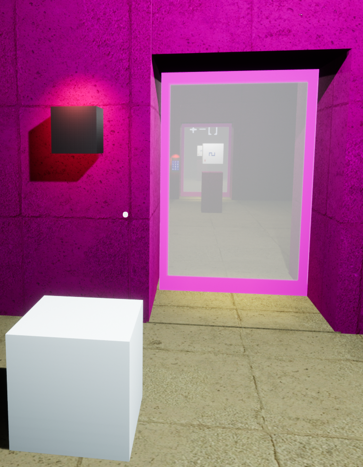

After slotting cube

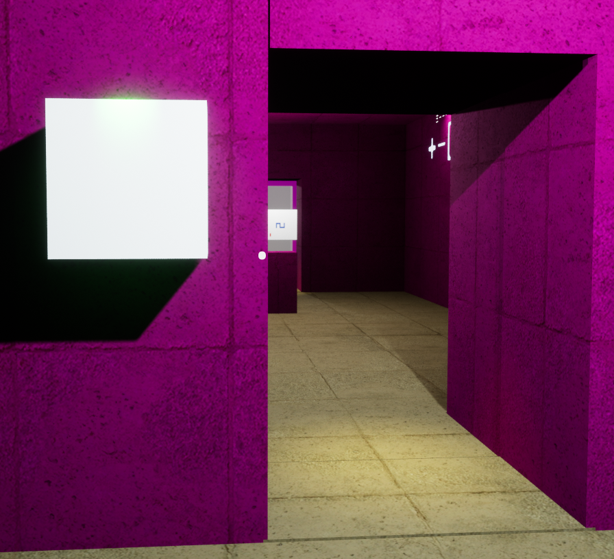

-   **Keypad**: Another mechanism to open a door. The [keypad](./Source/PuzzleGame/KeypadActor.h)! contains a
    preview screen, 10 numeric keys, one back button and one enter key.
    The keypad was modelled in Blender. The keypad is made using the
    Actor-component system in Unreal Engine.

Initial keypad appearance

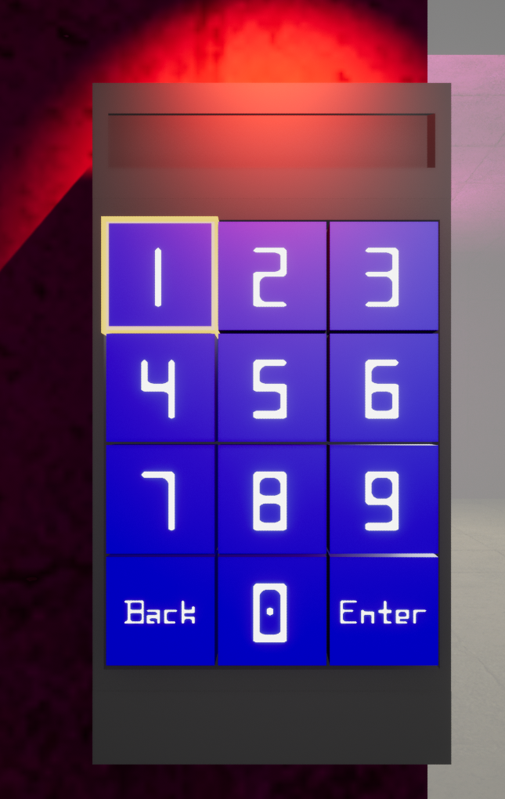

Keypad once the correct code is entered

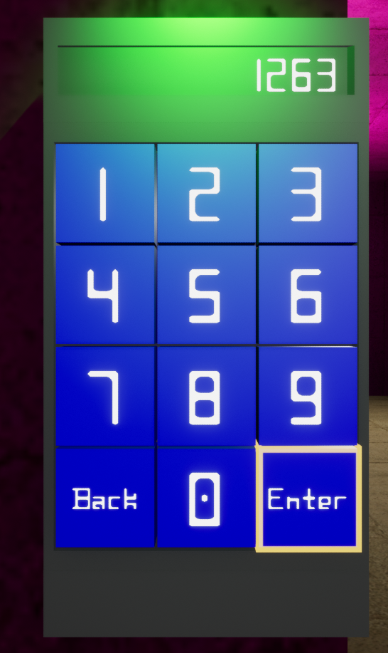

-   **Cube puzzle**: The cube puzzle's cube has been created as an
    [Examinable Actor](./Source/PuzzleGame/ExaminableActors.cpp)!. The cube has been created using Blender with
    specific UVs in order to allow cube puzzle texture to be applied to
    it. The cube when interacted can be moved about by the user to look
    at the various faces. The cube puzzle is placed in the room such
    that when the player interacts with it, the camera pans to the cube
    and the wall behind the cube contains the symbols needed to solve
    the puzzle.

**Cube puzzle before interaction**

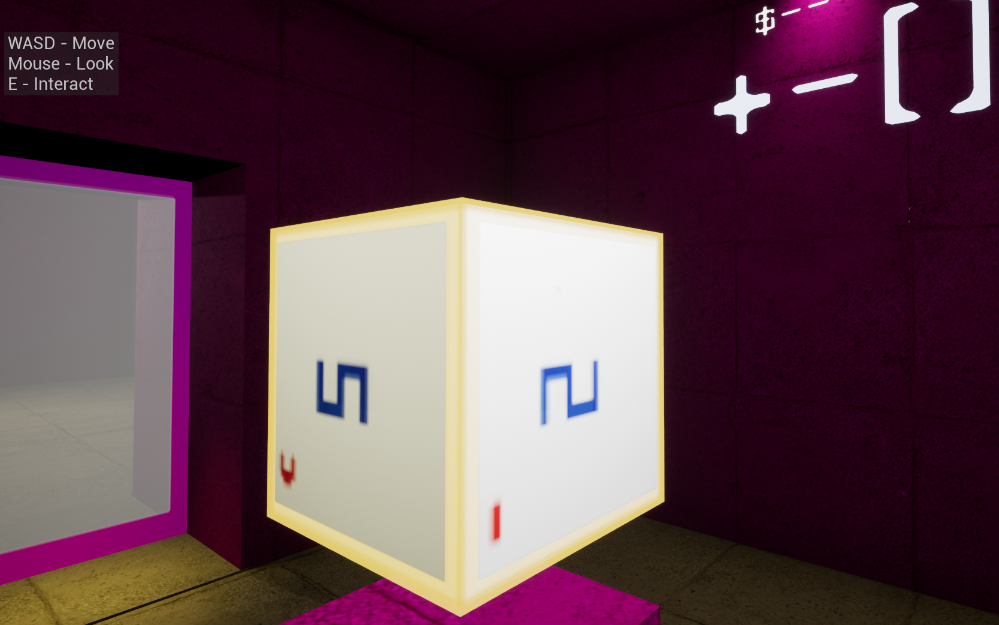 

**Cube puzzle after interaction**   

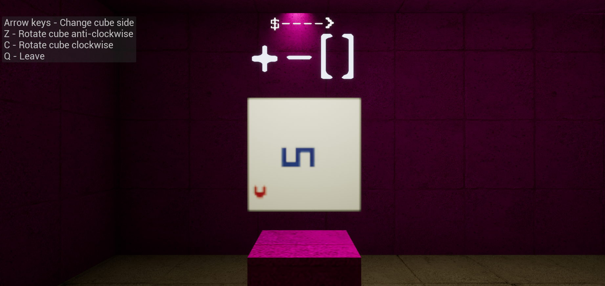 

> This is done to increase playability and reduce unwanted complexity in
> the puzzle. The texture for the cube and the sequence of characters
> that will be displayed on the wall is based on the same font family in
> order to reduce confusion. A roll feature to rotate the cube on its
> side was implemented to improve the user experience.

-   **Slide puzzle**: The [slide puzzle](./Source/PuzzleGame/InteractableSlidePuzzleActor.h)! was created keeping in mind the
    bias associated with it- functional fixedness. The slide puzzle is
    made up of 16 meshes, 1 slide frame and 15 [slide tiles](./Source/PuzzleGame/PickableSlideActor.h)!, each tile
    with its UVs updated to load the correct part of the image onto its
    top face. To implement the bias, the slide puzzle tiles should be
    added to the inventory of the character. This posed two challenges
    in implementing the puzzle.

1.  *Creation of Slide Puzzle:* Using the Actor-Component system
    mentioned in the keypad system, the slide frame can have sockets
    where the slide tiles can be attached. While this is useful to set
    up a normal slide puzzle, it causes an issue when the slide tiles
    need to be added to the inventory.

> All items in the inventory would be actors as they need to disappear
> into the world and appear when they need to be socketed or used. Using
> a static mesh component to display each of the tiles will not work as
> they are not actors and cannot be added to the inventory.

**Slide puzzle**

  -----------------------------------------------------------------------
  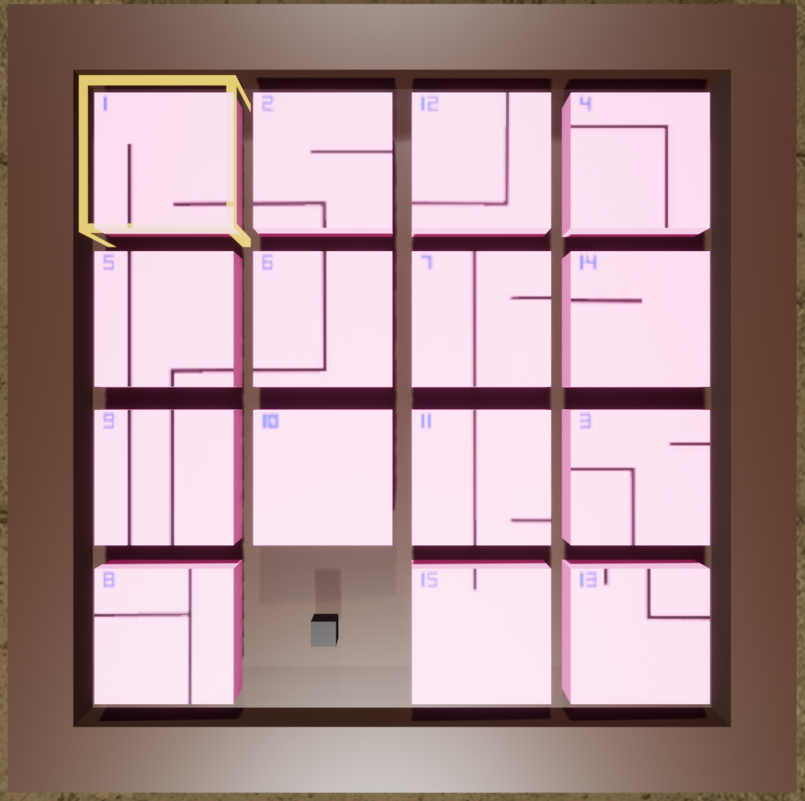

  -----------------------------------------------------------------------

> Unreal has a child actor component which can hold actors, but it does
> this by creating the default object of the class. This causes a need
> to create multiple Actor classes where the only difference is the mesh
> which is a redundancy. Also, when the tiles are added to the inventory
> and then added back to the puzzle, the connection between the Child
> Actor Component and the tile is lost. This prevents a tile from
> multiple pickups.
>
> To solve this, the deferred spawning mechanism Unreal engine was used
> to allow the meshes to be assigned dynamically. Thus, the slides have
> been created as a separate Actor C++ class which inherits the
> Interactable Actor C++ class. Also, a new blueprint based on the slot
> was created to add a visual cue to the learner that the interaction
> mechanic can be used in this context.

2.  *Control of Slide Puzzle:* Another issue with the slide puzzle arose
    about the controls. In a normal slide puzzle, there will be only
    operation involved with a slide, i.e., moving. And there will be
    only one slide moving in one direction at any given time. So just
    regular movement actions would be enough.

**Slide Puzzle operations:** 

(a)Selecting slide

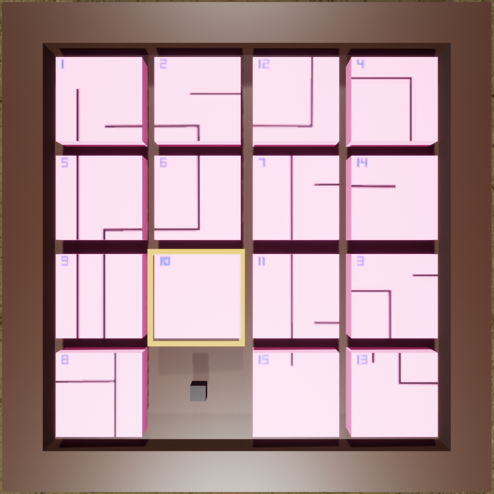 

(b)Movement of slide

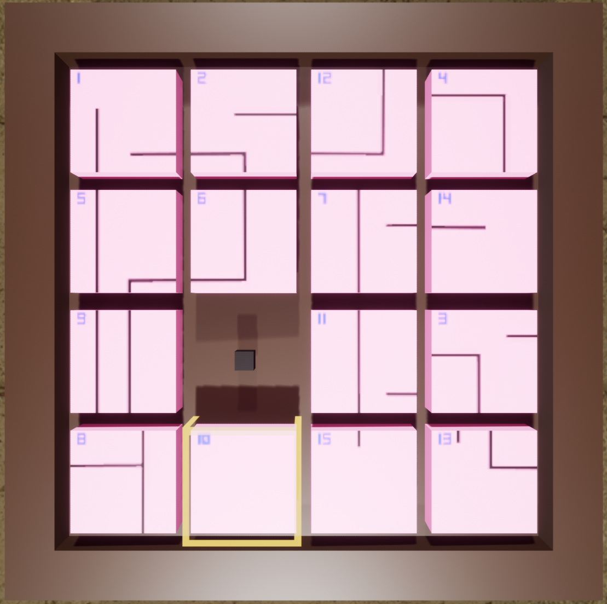

(c)Pick up slide

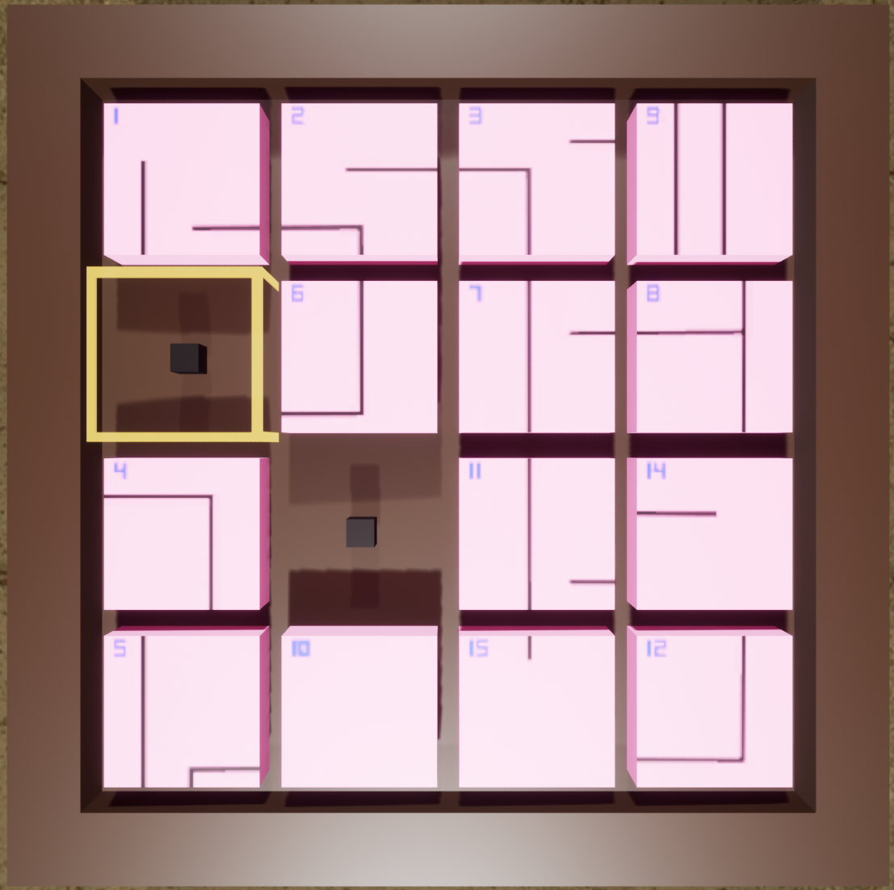

(d) Put down slide

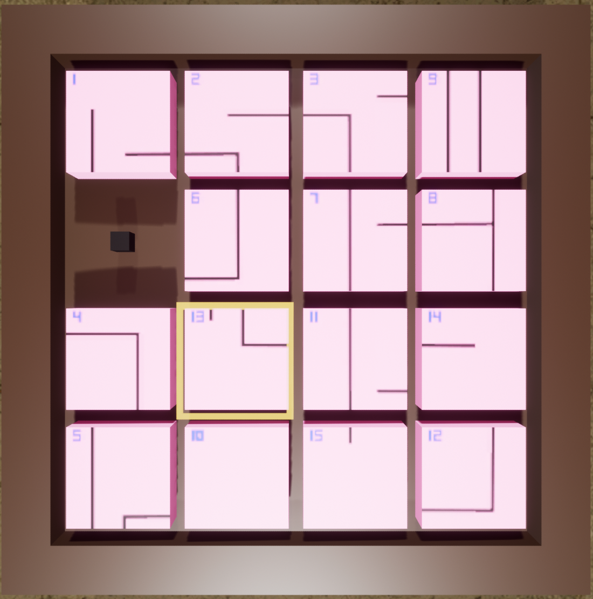

> In this slide puzzle, the player needs to be able to pick up a slide
> to add it to the inventory. This means that there is a specific need
> to select a specific slide and add it to the inventory. Similarly,
> there is a need to select the correct empty space to place back the
> picked-up slide.
>
> Another issue is with the movement of the slide. In the normal slide
> puzzle, there would be only one empty space which means that a
> particular slide would move in only one direction, i.e., towards the
> empty space. But that is not the case in this game. A player would be
> able to interact with the slide and remove it from the slide frame.
> This creates a new empty space. This means that one slide may move in
> more than one direction based on the number of empty spaces adjacent
> to it.
>
> Thus, a more complex control scheme where one set of movement controls
> helped in selecting the slide or empty space, another set of movement
> controls moved the selected slide to the empty space and the interact
> button is used to pick up/put down the slides.
